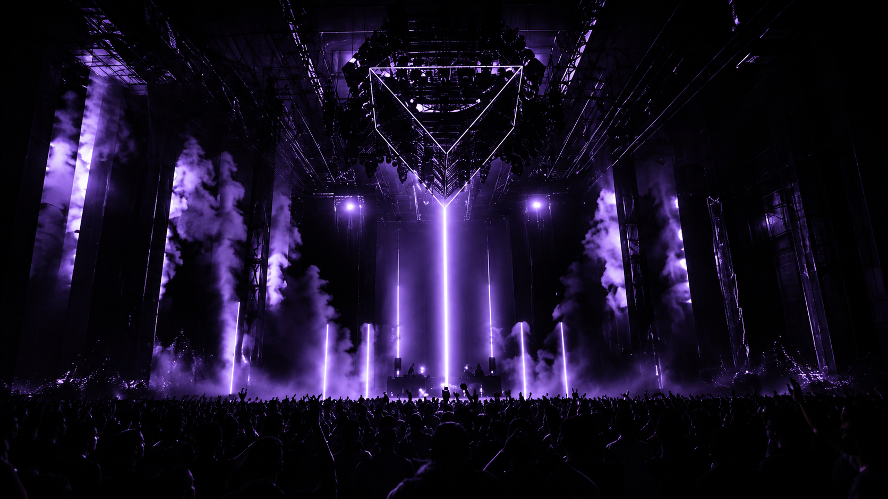

# Voltage — Festival Ticket Booking Stepper

A 4-step ticket booking flow for **Voltage**, a techno festival platform. Built as a fully client-side React app with a custom `useReducer` state machine, live per-field validation, and a design system matching the Voltage brand end to end.



## Features

- **4-step booking flow** — Personal Info → Contact → Event & Tier → Order & Add-Ons
- **Live validation** — per-field error/success states, disabled navigation until each step is valid
- **Event & tier selection** — browse festivals, pick a lineup, choose a ticket tier
- **Optional add-ons** — VIP tent, festival tattoo, glow bracelet, shuttle pass
- **Checkout modal** — full order summary before confirming
- **Booking confirmation** — unique booking ID generation, styled confirmation screen, toast notification
- **Dockerized dev environment** — one command to run, no local Node setup required

## Tech Stack

- **React + TypeScript**
- **Vite** — dev server & build tooling
- **styled-components** — fully custom design system, no CSS frameworks
- **react-router-dom** — routing
- **react-toastify** — booking confirmation notifications
- **react-icons** — iconography
- **Docker + Docker Compose** — reproducible dev environment

## Getting Started

### Option 1 — Docker (recommended)

No Node install required.

```bash
docker compose up
```

Then open **http://localhost:5171**.

### Option 2 — Local

```bash
npm install
npm run dev
```

Then open **http://localhost:5173**.

## Project Structure

```
src/
├── app/                 # App shell, routes, global styles
├── helpers/             # Helper functions, used for input validation
├── components/
│   ├── header/           # Site header + nav
│   ├── footer/            # Site footer
│   ├── homePage/          # Landing page hero
│   ├── progressBar/       # Stepper progress indicator
│   ├── stepper/            # Stepper container, reducer, state, types
│   ├── stepper-steps/       # Personal Info, Contact, Event & Tier, Order steps
│   ├── bookingSummary/       # Order review shown in checkout modal
│   ├── confirmationScreen/    # Post-booking confirmation
│   └── shared/                # Reusable input, button, error components
```

## Design

Dark, techno-club-inspired UI — near-black backgrounds, purple (`#7c3aed`) accents on selection/hover/active states, Orbitron display type for headings, uppercase letter-spaced labels throughout. Every interactive element (event cards, tier rows, add-on rows, buttons) follows the same visual language: dark border at rest, purple border on hover/selected.

## State Management

The entire booking flow runs on a single `useReducer` state machine — no external form library. Each step's validity is derived live from the current state, gating step navigation and the final checkout button until all required fields pass validation.